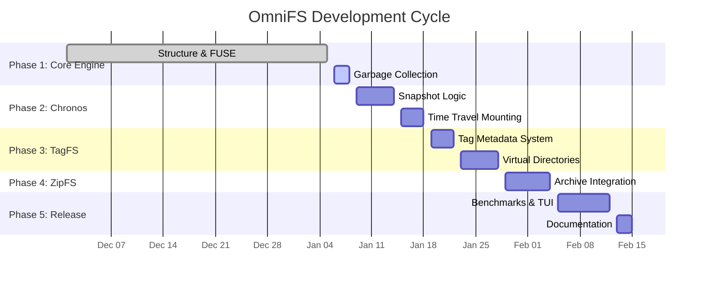

# Better-FS

A FUSE-based filesystem implementing content-defined chunking and deduplication in Rust.

## 📅 Project Timeline



## Overview

Better-FS demonstrates how modern backup and storage systems (like rsync, Dropbox, restic) achieve efficient deduplication through content-defined chunking. Files are split into variable-sized chunks using a rolling hash algorithm, enabling identical content blocks to be stored only once.

## Project Structure

```
better-fs/
├── src/
│   ├── main.rs          # FUSE filesystem implementation (mounts virtual filesystem)
│   ├── chunker.rs       # Rolling hash chunker (content-defined boundaries)
│   ├── storage.rs       # Content-addressed storage (SHA256-based)
│   └── file_manager.rs  # High-level file ingestion/restoration
├── tests/
│   └── backend_stress.rs # Integration tests (deduplication, stress tests)
└── Cargo.toml
```

### Component Breakdown

- **main.rs** - Virtual filesystem mounted at `/tmp/betterfs` with a single in-memory file
- **chunker.rs** - Splits data into ~4KB variable chunks using polynomial rolling hash
- **storage.rs** - Content-addressed storage (CAS) using SHA256 hashing
- **file_manager.rs** - Orchestrates chunking + storage, produces file "recipes"
- **backend_stress.rs** - Tests empty files, deduplication, large files, and error handling

## Quick Start

### Run the Filesystem
```bash
# Build and run (mounts at /tmp/betterfs)
cargo run

# In another terminal:
cat /tmp/betterfs/hello.txt
ls -la /tmp/betterfs/

# Unmount when done
fusermount -u /tmp/betterfs
```

### Run Tests
```bash
# Run all tests
cargo test

# See test output (println! messages)
cargo test -- --nocapture

# Run specific test suite
cargo test --test backend_stress

# Run unit tests only
cargo test --lib
```

### Test Chunking Algorithm
```bash
# Run chunker unit test with output
cargo test test_chunking_consistency -- --nocapture
```

## How It Works

1. **Content-Defined Chunking**: Files are split at boundaries determined by content patterns (not fixed positions), ensuring edits only affect nearby chunks
2. **Rolling Hash**: Efficient sliding window hash (O(1) per byte) identifies chunk boundaries
3. **Deduplication**: Identical chunks get the same SHA256 hash → stored once
4. **File Recipes**: Metadata structure storing chunk references + file size for reconstruction

## Requirements

- Rust (2024 edition)
- FUSE (Linux: `libfuse-dev`, macOS: macFUSE)

```bash
# Ubuntu/Debian
sudo apt install libfuse-dev

# Fedora
sudo dnf install fuse-devel
```

## Expected Test Results

```
Running 8 tests:
✓ Empty file handling
✓ Tiny file (< 48 bytes)
✓ Deduplication (16.7% storage savings on shared 50KB data)
✓ 1MB stress test (~250 chunks in ~0.3s)
✓ Missing chunk error handling
```

## Key Algorithms

- **Polynomial Rolling Hash**: `hash = (hash × 256 + byte) mod 1000000007`
- **Cut Condition**: `(hash & 0xFFF) == 0` → ~4KB average chunk size (2^12)
- **Content Addressing**: `filename = SHA256(chunk_data)`

## License

MIT
